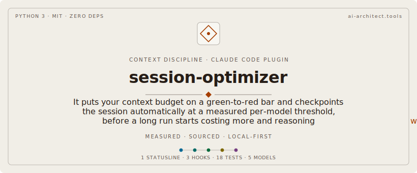

# session-optimizer

<p align="center"></p>

Two small, dependency-light tools for keeping long [Claude Code](https://code.claude.com)
sessions **readable, cheap, and un-poisoned**:

1. **`statusline-command.sh`** — a persistent, always-visible two-line status bar
   that color-codes context pressure on a green → yellow → red scale tied to a
   real per-model checkpoint threshold.
2. **`hooks/stop-context-guard.py`** — a `Stop` hook that detects when the
   session crosses that threshold and *performs the checkpoint protocol
   automatically*, so a session never silently grows past the point where it
   starts costing more and reasoning worse.

Together they turn the abstract "watch your context window" advice into an
enforced, visible budget.

---

## Why

A long Claude Code session degrades in four ways as the context window fills:

| Failure mode | What happens |
|---|---|
| **Context poisoning** | Stale, wrong, or superseded content accumulates and biases later reasoning. |
| **Session poisoning** | The session never resets, so early mistakes compound instead of being dropped at a clean boundary. |
| **Quota poisoning** | Every turn re-sends the whole oversized context, burning your 5-hour / 7-day rate-limit budget fast. |
| **Cost** | Per-turn cost scales with context size; the largest-context turns are the most expensive. |

The fix is a disciplined **checkpoint → clear → recall** cycle at a known token
threshold. This repo makes that discipline *visible* (status line) and
*automatic* (hook).

---

## Thresholds

Both tools use the same authoritative per-model budget:

| Model | Checkpoint threshold (WARN) | Session soft cap (HARD) |
|---|---|---|
| Claude Opus 4.8 | ~180K | 200K |
| Claude Sonnet 4.6 | ~180K | 200K |
| Claude Haiku 4.5 | ~120K | 200K (= context window) |

"Context tokens" are measured exactly as Claude Code's own `used_percentage`:
`input_tokens + cache_creation_input_tokens + cache_read_input_tokens`.

The 200K soft cap is conservative for the 1M-context Opus/Sonnet models — it
keeps sessions focused and checkpointed rather than letting them sprawl toward
the physical limit. Edit the constants if your workflow wants a different budget.

---

## 1. Status line

A persistent two-line bar rendered at the bottom of Claude Code (this is *not*
the SessionStart banner, which prints once and scrolls away — the status line is
always visible).

```
[Opus 4.8] [high+think] · my-project · git:(main)✗ · ⎇feature-x · PR#42
▓▓░░░░░░░░ ctx:20% tokens:200k ⚠ save+recall · $3.50 · ⏱30m0s · 5h:24% 7d:41% · +156/-23
```

- **Line 1** — model, reasoning effort (`+think` when extended thinking is on),
  current directory, git branch + dirty flag, worktree, and PR badge
  (colored by review state).
- **Line 2** — a context progress bar + percentage, token count, session cost,
  duration, rate-limit usage (5h / 7d), and lines added/removed.
- The bar, context %, and token count are colored **green → yellow → red** by the
  per-model threshold above, and a `⚠ save+recall` marker appears once you cross
  the 200K soft cap.

Every segment degrades gracefully when its field is absent (early session, no
git, non-subscriber, no PR, etc.). All colors are readable on a black terminal —
no dim/dark-grey text.

### Install

```bash
cp statusline-command.sh ~/.claude/statusline-command.sh
chmod +x ~/.claude/statusline-command.sh
```

Add to `~/.claude/settings.json`:

```json
{
  "statusLine": {
    "type": "command",
    "command": "bash ~/.claude/statusline-command.sh",
    "padding": 1,
    "refreshInterval": 10
  }
}
```

`refreshInterval: 10` keeps the time-based segments (duration, cost) current even
while the session is idle (e.g. waiting on background subagents). Requires
[`jq`](https://jqlang.github.io/jq/).

### Test

```bash
echo '{"model":{"display_name":"Opus 4.8"},"workspace":{"current_dir":"'"$PWD"'"},"context_window":{"used_percentage":20,"total_input_tokens":200000}}' \
  | bash statusline-command.sh
```

---

## 2. Stop context guard

A `Stop` hook that reads the latest assistant turn's token usage from the
transcript and enforces the budget:

| Level | Trigger | Action |
|---|---|---|
| below WARN | `ctx < threshold` | nothing — silent, no side effects |
| **WARN** | `ctx ≥ 180K` (120K Haiku) | captures **mechanical state for free** (date, model, token count, branch, last commit, modified files) as a summary-schema stub at `~/.claude/memories/checkpoints/{session_id,latest}.md`, and **blocks the stop exactly once as a reflection pause**: the model distills the session and hands the summary to the `memory-writer` subagent, which merges it into the stub — then the session **continues**. |
| **HARD** | `ctx ≥ 200K` | captures state **and blocks the stop exactly once**, injecting the checkpoint-finalize procedure so the model completes the checkpoint file (normally a formality — the WARN reflection already wrote it) and signals you to `/clear` + resume from the checkpoint. |

### Safety properties

- **Loop-safe** — honors `stop_hook_active`; each level fires at most once per
  session via a `/tmp` state file, so the hard block can never loop.
- **Non-fatal by construction** — any parse/IO error exits `0`. A `Stop` hook
  must never wedge a session.
- The status line is the passive visual warning; this hook is the active
  enforcement layer.

### The memory-writer subagent

The checkpoint itself is written by a **normal Claude Code subagent** —
`agents/memory-writer.md`, in the standard format produced by the `/agents`
create flow (frontmatter: `name`, `description`, `tools`, `model`; body =
system prompt). The pair follows the
[letta](https://github.com/letta-ai/letta) sleeptime pattern: a primary agent
plus a budgeted memory-manager agent that operates **on the memory store**
with memory verbs, on a cheap model (Haiku). The parent session distills its
own state into the summary schema (goals / file references / errors and fixes
/ current state / next steps, ≤500 words) — spending its expensive context
once on distillation, never on persistence plumbing — and the memory-writer
persists it. It writes exactly what it is given and never invents content.

Persistence is layered, primary first:

1. **Scoped memory store** (the [`zetetic-team-subagents`](https://github.com/cdeust/zetetic-team-subagents)
   memory layer): `memory-tool.sh rethink /memories/<scope>/checkpoint.md`
   for the checkpoint, plus one `cortex:remember` entry per durable WHY-level
   fact (decisions, rejected approaches, lessons), agent_topic-scoped.
2. **Stub-file fallback**: with no memory layer installed, the agent fills
   the hook's mechanical stub in place under
   `~/.claude/memories/checkpoints/` and mirrors it to `latest.md`. The hook
   never blocks on the memory layer's absence — graceful degradation, not a
   dependency.

### Install

```bash
mkdir -p ~/.claude/hooks ~/.claude/agents
cp hooks/stop-context-guard.py ~/.claude/hooks/stop-context-guard.py
chmod +x ~/.claude/hooks/stop-context-guard.py
cp agents/memory-writer.md ~/.claude/agents/memory-writer.md
```

(Equivalently, create the `memory-writer` agent interactively with `/agents`
— new agent, name `memory-writer`, tools `Read, Write, Edit`, model Haiku —
and paste the body of `agents/memory-writer.md` as its system prompt. The
hook only needs an agent with that name to exist; it spawns it through the
native Agent tool like any other subagent.)

Register the `Stop` hook (see `hooks/hooks.example.json`) in your plugin's
`hooks/hooks.json` or in `~/.claude/settings.json`, pointing at the installed
path. Requires Python 3.

**Or install as a plugin.** This repo ships a `.claude-plugin/plugin.json`
(v1.0.0) that wires the `Stop` guard automatically — add the repo as a
marketplace and install it, no manual hook registration needed.

### Test

```bash
T=$(mktemp); printf '{"message":{"model":"claude-opus-4-8","usage":{"input_tokens":105000,"cache_read_input_tokens":100000,"cache_creation_input_tokens":0}}}\n' > "$T"
echo '{"session_id":"demo","transcript_path":"'"$T"'","cwd":"'"$PWD"'","stop_hook_active":false}' \
  | python3 hooks/stop-context-guard.py | python3 -m json.tool
rm -f "$T"
```

Expected: a `decision: block` payload with the checkpoint procedure.

---

## 3. Subagent usage tracker (`hooks/subagent-tracker.py` + `tools/subagent_usage.py`)

The status line input and the Stop guard only see the **main thread**. Work done
by Task-tool subagents is logged as separate per-agent transcripts that a
parent-only reader never sees — the documented gap in
[anthropics/claude-code#32175](https://github.com/anthropics/claude-code/issues/32175)
and [ryoppippi/ccusage#313](https://github.com/ryoppippi/ccusage/issues/313).
On disk (verified layout):

```
~/.claude/projects/<encoded-cwd>/<session-id>.jsonl                 # main thread
~/.claude/projects/<encoded-cwd>/<session-id>/subagents/
    agent-<agentId>.jsonl                                           # subagent turns (isSidechain:true)
    agent-<agentId>.meta.json  -> {agentType, description, toolUseId}
    workflows/wf_*/agent-*.jsonl                                    # workflow subagents
```

Three layers recover that data:

- **`SubagentStop` hook** (`hooks/subagent-tracker.py`) — parses each finishing
  subagent's transcript (deduped by `message.id`, billed per the record's own
  `message.model`, cache split by TTL), reads the sibling `.meta.json` for
  `agentType`/`description`, and folds it into a per-session aggregate at
  `/tmp/zetetic-subagents-<session_id>.json` (keyed by `agentId`, so re-firing
  updates rather than double-counts).
- **Status line** — reads that aggregate and shows `🤖N · tokens · $cost` so
  live subagent spend is visible alongside the main thread.
- **Stop guard** — surfaces cumulative session spend (main + subagents) in the
  checkpoint message and stub. The context-window *decision* stays
  main-thread-only (mixing in subagent tokens would mis-trigger checkpoints);
  only the reported figure is enriched.

### Pricing (sourced)

Token cost uses Anthropic's published per-MTok rates and cache multipliers
(Opus 4.8 $5/$25, Sonnet 4.6 $3/$15, Haiku 4.5 $1/$5, Fable 5 $10/$50; cache
write 1.25× input at 5m / 2× at 1h, cache read 0.1×). Every constant cites its
source at the use site in `tools/subagent_usage.py`.

### Retrospective report

`tools/subagent_usage.py` doubles as a CLI that parses **all** subagent
transcripts across a project and reports cost grouped by `agent_type`:

```bash
python3 tools/subagent_usage.py [/path/to/project]   # human table
python3 tools/subagent_usage.py --json               # machine-readable
```

### Install

Add the `SubagentStop` entry from `hooks/hooks.json` to your settings;
`subagent-tracker.py` imports the shared core
from the sibling `tools/` directory, so keep them under the same plugin root.

### Test

```bash
SID="demo-$(date +%s)"
echo '{"session_id":"'"$SID"'","transcript_path":"<a real agent-*.jsonl path>","cwd":"'"$PWD"'"}' \
  | python3 hooks/subagent-tracker.py
cat "/tmp/zetetic-subagents-$SID.json" | python3 -m json.tool
```

---

## 4. Refine gate (`hooks/refine_gate.py` + `skills/refine/`)

Communication failures cost more than code failures: "make it work
exactly like the SSE solution" carries precise intent that the model
can bind to the wrong artifact and then build the wrong thing —
correctly. The refine gate makes that binding explicit and cheap to
correct BEFORE work starts.

A `UserPromptSubmit` hook inspects every prompt on two tiers:

* **Tier 1 — reference markers**: prior-artifact shorthand ("the last
  release"), comparisons to unstated referents ("like before",
  "exactly as"), repeat-failure phrasing ("still broken", "back to
  square one") → inject the full binding-table instruction.
* **Tier 2 — ungrounded work request**: the prompt asks for work
  (fix/build/improve/problem/…) but contains no concrete anchor — no
  file path, commit sha, or line ref. Named systems/variables ("the
  memory system", "the heat variable") must then be bound to their
  actual code artifacts before reasoning. Prompts the user grounded
  themselves pass through untouched. Slash commands are never gated;
  the hook always exits 0 (it can inform, never block).

The injected instruction points at the bundled `/refine` skill: build
a binding table (reference → artifact, with evidence), separate
symptom from goal, select an execution strategy from a research-backed
table (15 strategies re-verified against the 2024–2026 literature,
counter-evidence included — e.g. intrinsic self-correction degrades
reasoning, arXiv:2310.01798; CoT prompting is marginal on reasoning
models), and define acceptance criteria as EXTERNAL signals: run the
test, fetch the source, measure — never the model re-checking itself.

Test it directly:

```bash
echo '{"prompt":"there is a problem in the memory system with the heat variable"}' \
  | python3 hooks/refine_gate.py | python3 -m json.tool
```

Expected: a `hookSpecificOutput.additionalContext` payload carrying the
binding instruction. A grounded prompt (one naming a real file path)
produces no output.

### Token-usage ledger (measured, reproducible)

The gate must not eat the budget it exists to protect. Two instruments
keep that honest:

* `tests/test_refine_gate.py` pins the contract: silent prompts cost
  ZERO context, and any injection stays under a 400-token ceiling
  (estimated at 4 chars/token — Anthropic's glossary gives ~3.5
  chars/token EN, so the estimate under-counts ~12%; the ceiling has
  >10x headroom over the current ~275).
* `tools/measure_refine_overhead.py` replays your OWN prompt history
  (local transcripts, nothing leaves the machine). Measured 2026-06-12
  on 117 real prompts across 40 transcripts: fired on 38% (tier 1: 17,
  tier 2: 27, silent: 73), ~275 est. tokens per fired prompt, ~103 per
  prompt overall ≈ **1.3% of a 160k-token session budget per 20-prompt
  session**.

The benefit side is counterfactual and is NOT claimed as measured: a
mis-bound prompt costs roughly a full wrong-direction session
(~10⁵ tokens — e.g. the delivery-layer machinery this gate's design
case produced and later deleted). At ~2k injected tokens per
20-prompt session, the gate breaks even if it prevents one mis-binding
per ~80 sessions.

### Where it runs

Hooks and statusline run wherever Claude Code plugins run: **CLI,
desktop app, IDE extensions, and Cowork** (declared `runtime:
["cli", "cowork"]`). The claude.ai / Claude Desktop **chat** surface
has no hook mechanism — there, upload `skills/refine/` as an Agent
Skill (same SKILL.md format): the `/refine` procedure travels; the
automatic per-prompt gate does not.

---

## License

[MIT](LICENSE) © Clement Deust
