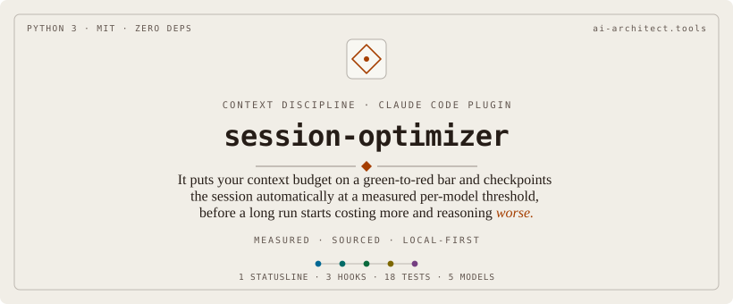

# session-optimizer

<p align="center"></p>

[](https://github.com/cdeust/session-optimizer/actions/workflows/ci.yml)
[](https://github.com/cdeust/session-optimizer/actions/workflows/codeql.yml)
[](https://securityscorecards.dev/viewer/?uri=github.com/cdeust/session-optimizer)
[](LICENSE)

**Cross-platform prompt refinement for Codex, Gemini CLI, and Claude Code,
plus Claude-native context-budget and telemetry controls.** The portable
`refine-gate` skill binds vague requests to concrete evidence on all three
hosts. `context-guard` and `statusline` add lifecycle automation where Claude
Code exposes the required hooks, session files, and statusline metrics.

The repository ships three small, dependency-light, **independently
installable** packages. Install exactly the ones your host supports and you
need; none requires the others.

```
/plugin marketplace add cdeust/session-optimizer
```

| Plugin | One-line install | What it does |
|---|---|---|
| [**context-guard**](plugins/context-guard) | `/plugin install context-guard@session-optimizer-marketplace` | A `Stop` hook enforces a per-model context budget: at the WARN threshold it writes a mechanical checkpoint stub and delegates persistence to a budgeted `memory-writer` subagent as a reflection pause; at the hard cap it forces checkpoint → `/clear` → resume. A `SubagentStop` tracker surfaces true session spend (main thread + subagents). |
| [**refine-gate**](plugins/refine-gate) | Claude: `/plugin install refine-gate@session-optimizer-marketplace`; Codex/Gemini: [portable install](plugins/refine-gate/README.md) | A portable skill that binds vague prompt references ("the SSE solution", "like before", "still broken") to concrete artifacts with evidence, then selects an execution strategy from a research-backed table before any code is touched. Claude Code additionally receives an automatic `UserPromptSubmit` hook. |
| [**statusline**](plugins/statusline) | `/plugin install statusline@session-optimizer-marketplace` | A multi-line status bar: discrete heat-track context bar tied to per-model checkpoint thresholds, one deduplicated cost ledger covering subagent spend, telemetry (tok/s, compactions, cache countdown), rate-limit gauges with burn-rate pacing, and terminal-width fitting. Ships an install skill — after installing, ask Claude to "install the statusline" and it wires everything. |

For Codex, Gemini CLI, and Claude installation commands, see the
[refine-gate README](plugins/refine-gate/README.md).

## Why

A long Claude Code session degrades in four ways as the context window fills:

| Failure mode | What happens |
|---|---|
| **Context poisoning** | Stale, wrong, or superseded content accumulates and biases later reasoning. |
| **Session poisoning** | The session never resets, so early mistakes compound instead of being dropped at a clean boundary. |
| **Quota poisoning** | Every turn re-sends the whole oversized context, burning your 5-hour / 7-day rate-limit budget fast. |
| **Cost** | Per-turn cost scales with context size; the largest-context turns are the most expensive. |

The fix is a disciplined **checkpoint → clear → recall** cycle at a known
token threshold, plus prompts whose references are bound before work starts.
These plugins make that discipline *visible* (statusline), *automatic*
(context-guard), and *cheap to get right* (refine-gate).

## How the plugins cooperate (without depending on each other)

- **Shared thresholds** — context-guard's Stop hook and the statusline's bar
  colors both read `~/.claude/ctxguard-thresholds.json` (first substring
  match on the model id wins; each has an embedded fallback). One file, two
  consumers: passive display and active enforcement stay on par by
  construction. Documented in both plugins' READMEs.
- **Subagent spend** — context-guard's `SubagentStop` tracker maintains a
  per-session aggregate in `/tmp`; the statusline shows it live when both
  are installed, and stays silent otherwise.
- **No hard dependencies** — every integration degrades gracefully when the
  other plugin (or an optional memory layer) is absent. The checkpoint
  protocol's default wording references only tools that exist in vanilla
  Claude Code; a scoped memory store is detected at runtime and used only
  when installed.

## Repository layout

```
.claude-plugin/marketplace.json   # the marketplace (three plugins + deprecated meta shim)
.agents/plugins/marketplace.json # Codex marketplace (portable refine-gate only)
plugins/
  context-guard/                  # Stop guard + memory-writer agent + SubagentStop tracker
  refine-gate/                    # UserPromptSubmit gate + /refine skill
  statusline/                     # renderer + helpers under assets/, install skill, auto-update hook
tests/                            # the three suites, run from the repo root
```

Each plugin carries its own `.claude-plugin/plugin.json`, `hooks/hooks.json`,
and README.

## Migrating from session-optimizer v1.x

Up to v1.4.3 this repo shipped one monolithic `session-optimizer` plugin. In
v2.0.0 it split into the three plugins above; the root `session-optimizer`
plugin remains **only as a deprecation shim** — it registers no functional
hooks and just announces the migration at session start.

1. Install the plugins you actually use (any subset):
   `context-guard`, `refine-gate`, `statusline`.
2. Uninstall the old plugin: `/plugin uninstall session-optimizer`.
3. Your `~/.claude/ctxguard-thresholds.json`, checkpoint files, and
   statusline config are untouched — the new plugins read the same paths.
4. If you had installed the `memory-writer` agent manually into
   `~/.claude/agents/`, you can remove it; the context-guard plugin ships
   its own copy (`context-guard:memory-writer`).

## Tests

```bash
python -m pip install --require-hashes -r requirements-dev.lock
coverage erase
coverage run -m pytest -q
coverage combine
coverage report
bash tests/statusline/test_heat_rgb.sh
bash tests/statusline/test_fit_and_pace.sh
```

CI (`.github/workflows/ci.yml`) runs the Python and shell suites, enforces at
least 80% statement coverage over shipped Python, shellchecks the statusline,
and validates every plugin, hook, and marketplace JSON. The current measured
result is 94% (712 statements, 42 missed, 50 tests; measured 2026-08-03).

## Project policy and security

- [Architecture and host boundaries](docs/ARCHITECTURE.md)
- [Security policy and release verification](SECURITY.md)
- [Security assurance case](docs/ASSURANCE-CASE.md)
- [Governance and access continuity](GOVERNANCE.md)
- [Contributing and mandatory test policy](CONTRIBUTING.md)
- [August 2026–July 2027 roadmap](docs/ROADMAP.md)
- [OpenSSF Scorecard policy](docs/SCORECARD.md)
- [Privacy policy](PRIVACY.md)

## License

[MIT](LICENSE) © Clement Deust
